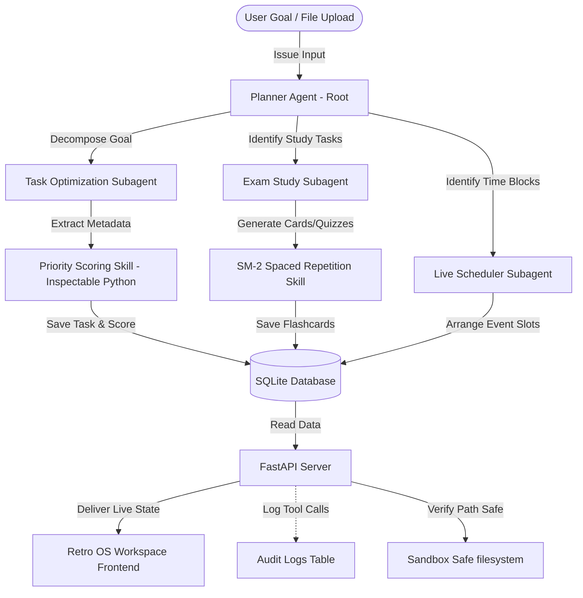

# Synapse — Multi-Agent AI Study Planner & Scheduler Workspace

> *An AI-powered, retro-styled cognitive companion that orchestrates study goals, schedules time slots, resolves conflicts, and manages active recall using deterministic spaced repetition.*

---

## 1. Overview

Synapse is a local-first, privacy-respecting cognitive assistant and study planning workspace. It bridges the flexibility of LLM-based multi-agent orchestration with the strict predictability of deterministic code. When you provide a high-level goal (or upload a PDF textbook chapter/syllabus), Synapse's agents decompose it into structured tasks, compute prioritization metrics, schedule conflict-free calendar events, and draft active-recall flashcards.

The system is wrapped in a high-fidelity **Retro OS Control Workspace** UI, featuring flat brutalist borders, hard offset shadows, synthesized 8-bit audio soundscapes, live agent execution consoles, and real-time streak heatmap trackers.

---

## 2. Tech Stack

### Frontend (Desktop Shell UI)
* **Framework**: React 18, Vite 8 (Client-side bundling and hot-module replacement)
* **Styling**: Tailwind CSS & Vanilla Custom CSS (Retro OS brutalism system tokens, CRT screen filters, and collapse shadow active states)
* **Assets & Icons**: Lucide React Icons & custom SVG asset bindings
* **Audio**: Custom HTML5 Web Audio Synthesizer (for interactive 8-bit sound effects)

### Backend (REST API Server)
* **Framework**: FastAPI (Python 3.10+)
* **Database**: SQLite (Local-first, structured storage)
* **Security & Auth**: Pydantic v2 (Data validation), Passlib with Bcrypt (Password cryptography), PyJWT (JSON Web Tokens)
* **File Operations**: PyPDF (PDF document layout parsing and text extraction)

### Artificial Intelligence & Orchestration
* **Agent Framework**: Google **Agent Development Kit (ADK)** for multi-agent loops and tool calls
* **Local Models**: 
  * **Planner Agent (Root)**: Powered by `llama3.2:latest` (CPU optimized)
  * **Subagents**: Powered by `qwen2.5:1.5b` (Highly efficient for fast prioritization scoring, scheduling, and flashcard drafting)

---

## 3. Architecture Flow



---

## 4. Repository Folder Structure

```text
├── agents/                      # LLM Orchestrator Subagents (ADK framework)
│   ├── planner.py               # Root orchestrator: decomposes goals & schedules
│   ├── task_optimizer.py        # Optimizes subtask weights and metadata
│   ├── exam_study.py            # Generates active-recall flashcard sets
│   └── live_scheduler.py        # Maps calendar slots and handles conflicts
├── mcp_server/                  # FastAPI Backend API & SQLite DB Server
│   ├── database.py              # SQLite schemas and runtime migration logic
│   ├── auth.py                  # JWT authentication and cryptography
│   ├── schemas.py               # Pydantic input models & validation rules
│   ├── main.py                  # REST API routes and conflict handlers
│   └── sandbox/                 # Sandboxed environment for safe file executions
├── frontend/                    # Vite + React Neo-Brutalist UI Workspace
│   ├── src/
│   │   ├── components/          # GUI window frames (TaskBoard, Flashcards, Calendar)
│   │   ├── utils/               # Fetch API bindings and audio synthesizers
│   │   ├── App.jsx              # Main dashboard wrapper & streak badge handlers
│   │   └── index.css            # Retro neo-brutalist Flat styling rules
│   ├── package.json             # Frontend dependency packages
│   └── vite.config.js           # Vite server build configuration
├── skills/                      # Deterministic Python Modules
│   ├── spaced_repetition/       # SM-2 algorithms and synapse CLI runner
│   └── task_scoring/            # Weighted prioritization score mappings
├── tests/                       # Test Suites
│   └── test_sm2.py              # Spaced repetition unit validation tests
├── requirements.txt             # Python backend dependencies
├── synapse.bat / synapse        # Root execution commands for CLI testing
└── README.md                    # System documentation
```

---

## 5. Key Features

### 📅 Self-Healing Timetable (Conflict Resolver)
If tasks are scheduled close together or overlap (e.g. Task A: 12:00 to 2:30, Task B: 2:15 to 4:00), the backend's self-healing database resolver automatically shifts subsequent blocks back-to-back (Task B becomes 2:30 to 4:15), preserving planned task durations.

### 🧠 Spaced Repetition (SuperMemo-2)
Spaced repetition calculations are 100% mathematical and deterministic (no LLM hallucinations). It stores card repetitions, ease factors, intervals, and next review dates in SQLite.

### 🎯 Eisenhower Matrix Task Board
Tasks are prioritized into four flat-colored retro boxes based on importance and urgency ratings:
* **Q1: DO FIRST** (Urgent & Important)
* **Q2: SCHEDULE** (Important, Not Urgent)
* **Q3: DELEGATE/OPTIMIZE** (Urgent, Not Important)
* **Q4: ELIMINATE** (Neither)

### 📈 Engagement Streak & Heatmap
Tracks consecutive days you have completed at least one flashcard review. Displays a live flame badge on the sidebar and a neo-brutalist 30-day contribution activity calendar grid.

### 📄 PDF Document Upload Planner
Click the teal `[FILE]` button in the chat console to upload study guides, syllabus documents, or text files. The backend extracts the text (utilizing `pypdf`) and auto-generates your calendar sessions, subtasks, and flashcards from it.

### 🔗 External Calendar Export
Export your local calendar to standard iCal format (`.ics`) by clicking the export action. It supports both header tokens and query-string token fallback (`?token=...`) so you can download and sync it directly into Google Calendar, Apple Calendar, or Outlook.

---

## 6. Algorithms & Math Mappings

### A. SuperMemo-2 (SM-2) Spaced Repetition
Calculates intervals and ease factors based on user-submitted grading quality $q$ (scale $0$ to $5$):
* **Quality $q < 3$ (Lapse)**: Reset consecutive repetitions to $0$ and interval to $1$ day.
* **Quality $q \ge 3$ (Success)**:
  * Repetition $1$: Interval = $1$ day.
  * Repetition $2$: Interval = $6$ days.
  * Repetition $n > 2$: Interval = $\text{round}(\text{Interval}_{n-1} \times \text{Ease Factor})$.
* **Ease Factor Update**: 
  $$\text{EF}' = \text{EF} + \left(0.1 - (5 - q) \times \left(0.08 + (5 - q) \times 0.02\right)\right)$$
  *EF' is floored at an absolute minimum value of 1.3 to prevent cards from piling up too fast.*

### B. Priority Scoring (Eisenhower Matrix)
Tasks are scored on a scale from $1.0$ to $5.0$. Proximity to due dates increases priority automatically:
$$\text{Score} = (\text{Importance} \times 0.45) + (\text{Urgency} \times 0.35) + ((\text{Time Factor} \times 5.0) \times 0.20)$$
* **Time Factor**: Evaluated as $1.0$ if the task is overdue, $0.0$ if it is due $\ge 14$ days in the future, or linearly scaled as $1.0 - (\text{days remaining} / 14)$ otherwise.

### C. Self-Healing Calendar Shifter
Cascades through calendar events ordered by `start_time` ASC. If `current_start < previous_end`:
* `Duration = current_end - current_start`
* `New Start = previous_end`
* `New End = New Start + Duration`
Updates the database and propagates downstream to heal subsequent events.

---

## 7. Setup, Installation & Running the Project

Ensure you have **Python 3.10+** and **Node.js 18+** installed.

### Step 1: Install Ollama & Pull Models
Install [Ollama](https://ollama.com) and run these commands to fetch the local LLM weights:
```bash
ollama pull llama3.2:latest
ollama pull qwen2.5:1.5b
```

### Step 2: Set up the Python Backend
```bash
# Create a virtual environment
python -m venv .venv

# Activate the virtual environment
# Windows PowerShell:
.venv\Scripts\Activate.ps1
# macOS/Linux:
source .venv/bin/activate

# Install package dependencies
pip install -r requirements.txt
```

### Step 3: Seed Database & Run the Server
Create your login credentials and start FastAPI:
```bash
# Seed initial user credentials (e.g. admin / password123)
python add_user.py admin password123

# Start the FastAPI server
python -m mcp_server.main
```
*The API server will launch at `http://127.0.0.1:8000`.*

### Step 4: Launch the Frontend
In a new terminal window, compile the assets and launch the dev environment:
```bash
cd frontend
npm install
npm run dev
```
*Open your browser and navigate to `http://localhost:5173`. Log in with your seeded credentials (e.g., `admin` / `password123`).*

---

## 8. CLI Skill Execution & Test Verification

You can execute and verify the SM-2 algorithm calculations directly from the command line:

### CLI Wrapper Test (Windows)
```powershell
.\synapse.bat skills run spaced_repetition --quality 4 --repetitions 2 --ease_factor 2.3 --interval 6
```

### CLI Wrapper Test (Bash/Linux)
```bash
./synapse skills run spaced_repetition --quality 4 --repetitions 2 --ease_factor 2.3 --interval 6
```

### Output Format
The tool will execute the deterministic Python logic and output the scheduled parameters in JSON format:
```json
{
  "next_interval": 14,
  "next_repetitions": 3,
  "next_ease_factor": 2.3,
  "next_review_date": "2026-07-20"
}
```

### Run Unit Tests
Validate the SM-2 logic and boundaries by running the test suite:
```bash
.venv/Scripts/python -m unittest tests/test_sm2.py
```

---

## 9. Security & Model Context Protocol (MCP) Sandbox

Synapse operates a secured sandboxed directory for filesystem writes/reads located at `mcp_server/sandbox/`. Path traversal (`..`) sequences or absolute paths pointing outside of this directory are blocked and rejected with a `403 Forbidden` status. 

Every action (agent goals, tool executions, and file operations) is logged to the local SQLite `audit_logs` table for audit visibility. You can inspect this log by maximizing the **System Logs (`SYSTEMLOG.EXE`)** window at the bottom of the Workspace dashboard.

---

## 10. End-to-End Demo Flow

1. **Submit Goal / File**: Paste a text goal or upload a study file in **`MISSION_CONTROL.EXE`**.
2. **Decomposition**: `PlannerAgent` outlines tasks and determines if they are general or study-related.
3. **Optimizing**: `TaskOptimizer` sets importance, urgency, and due dates, which are converted to Eisenhower quadrants.
4. **Generating Flashcards**: `ExamStudyAgent` creates active-recall Q&A cards and puts them in `MEMORY_VAULT.EXE`.
5. **Conflict Resolution**: `LiveScheduler` puts events on `TIME_GRID.EXE`. Overlaps are resolved automatically in the database.
6. **Active Study**: As you review cards, you grade your recall ($0$ to $5$). The SM-2 calculator updates card schedules, and the heatmap tracks your daily study streaks!
