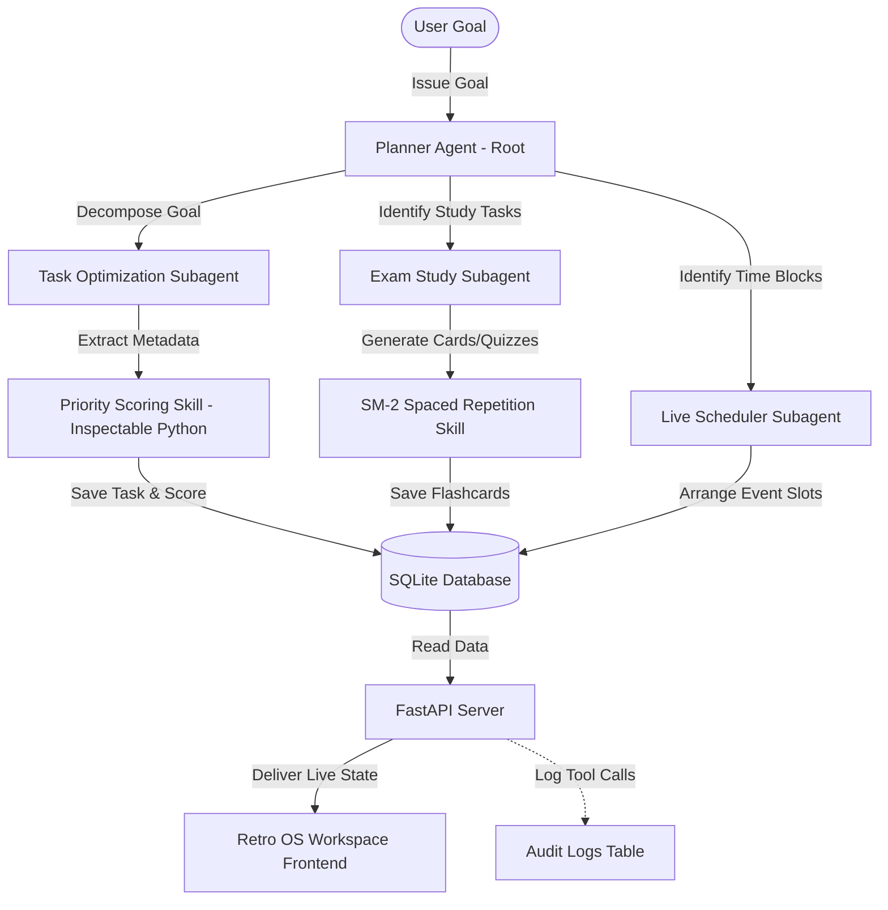

# Synapse — Multi-Agent Study & Scheduling System

Synapse is a local-first, multi-agent orchestrator and study planning application. Powered by Google's **Agent Development Kit (ADK)** and local **Ollama** models, it breaks down study goals, schedules review calendars, calculates priorities, and builds spaced repetition flashcards.

The system features a **Retro OS Control Workspace** UI complete with synthesized 8-bit sound effects, overlapping window panes, and live agent terminal indicators.

---

## 1. Architecture Flow



---

## 2. Repository Folder Structure

```text
├── agents/                      # LLM Orchestrator Subagents (ADK framework)
│   ├── planner.py               # Root orchestrator: decomposes goals & schedules
│   ├── task_optimizer.py        # Optimizes subtask weights and metadata
│   ├── exam_study.py            # Generates active-recall flashcard sets
│   └── live_scheduler.py        # Maps calendar slots and handles conflicts
├── mcp_server/                  # FastAPI Backend API & SQLite DB Server
│   ├── database.py              # SQLite schemas and runtime migration logic
│   ├── auth.py                  # JWT authentication and cryptography
│   ├── schemas.py               # Pydantic input models & validation rules
│   ├── main.py                  # REST API routes and conflict handlers
│   └── sandbox/                 # Sandboxed environment for safe file executions
├── frontend/                    # Vite + React Neo-Brutalist UI Workspace
│   ├── src/
│   │   ├── components/          # GUI window frames (TaskBoard, Flashcards, Calendar)
│   │   ├── utils/               # Fetch API bindings and audio synthesizers
│   │   ├── App.jsx              # Main dashboard wrapper & streak badge handlers
│   │   └── index.css            # Retro neo-brutalist Flat styling rules
│   ├── package.json             # Frontend dependency packages
│   └── vite.config.js           # Vite server build configuration
├── skills/                      # Deterministic Python Modules
│   ├── spaced_repetition/       # SM-2 algorithms and synapse CLI runner
│   └── task_scoring/            # Weighted prioritization score mappings
├── tests/                       # Test Suites
│   └── test_sm2.py              # Spaced repetition unit validation tests
├── requirements.txt             # Python backend dependencies
├── synapse.bat / synapse        # Root execution commands for CLI testing
└── README.md                    # System documentation
```

---

## 3. Setup & Installation

Ensure you have **Python 3.10+** and **Node.js 18+** installed.

### Step 1: Initialize Ollama Models (CPU Optimized)
Ensure Ollama is running, then pull the required models:
```bash
# Pull the Planner agent model
ollama pull llama3.2:latest

# Pull the highly efficient subagent model
ollama pull qwen2.5:1.5b
```

### Step 2: Set up the Python Backend
We recommend using a virtual environment:
```powershell
# Create virtual environment
python -m venv .venv

# Activate (Windows PowerShell)
.venv\Scripts\Activate.ps1

# Install dependencies
pip install -r requirements.txt
```

### Step 3: Run the Backend API
Start the FastAPI server:
```bash
python -m mcp_server.main
```
The server will run on `http://127.0.0.1:8000`.

### Step 4: Run the Frontend App
Install Node packages and launch Vite:
```bash
cd frontend
npm install
npm run dev
```
Open your browser to `http://localhost:5173`. Use credentials `admin` / `password123` to log in.

### Step 5: Managing Users (Optional)
If you want to log in with a different user, you can create new user credentials using the included helper script. In your backend terminal, run:
```powershell
python add_user.py <new_username> <new_password>
```
*Note: You only need to run this command **once** for each user you want to add. Their details are permanently stored in the local SQLite database.*

---

## 4. Security & Integrity Rejection Demo

Every file read/write operation is sandboxed within `mcp_server/sandbox/`. Path traversal sequences (`..`) or paths resolving outside the sandbox are strictly blocked.

### Try a Malicious Traversal (Rejection Demonstration)
You can verify the security policy by triggering a POST request to read files outside the sandbox. 

Open a terminal and run the following command (which attempts to traverse directories):
```powershell
Invoke-RestMethod -Uri "http://127.0.0.1:8000/api/sandbox/read" `
  -Method POST `
  -Headers @{ "Authorization" = "Bearer <YOUR_JWT_TOKEN>" } `
  -ContentType "application/json" `
  -Body '{"file_path": "../../../Windows/win.ini"}'
```

**Expected Rejection Response:**
```json
{
  "detail": "Forbidden: Access denied outside sandbox context."
}
```
*Note: Any attempt is also logged directly to the `audit_logs` table in SQLite for security inspection.*

---

## 5. Multi-Agent Pipeline Walkthrough

1. **User Request / File Upload**: The operator submits a study goal (e.g., *"Prepare for my Math exam next Friday"*) or uploads a syllabus/guide (.pdf or .txt) in the terminal.
2. **Planner Decomposition**: The **Planner Agent** (powered by `llama3.2`) parses the goal/text, safe-handles missing properties, and divides it into a JSON array of 2-4 subtasks.
3. **Task Optimization**: The **Task Optimization Agent** rates the importance and urgency of each subtask. It calls the inspectable Python scoring skill to calculate the score and map it to an Eisenhower Matrix quadrant.
4. **Exam Study Generation**: The **Exam Study Agent** generates high-quality active recall Q&A flashcards (subject tagged and supporting visual attachments) and schedules them for immediate review.
5. **Live Scheduler**: The **Live Scheduler Agent** maps out timetable blocks (starting tomorrow) with a 15-minute buffer between tasks, ensuring the highest priority tasks are scheduled first.
6. **Self-Healing Conflict Resolution**: If any scheduled blocks overlap, the database resolver automatically shifts subsequent blocks back-to-back, preserving planned task durations.
7. **Audit & Dashboard Sync**: The tool actions are logged to SQLite, and the frontend automatically pulls the updated tasks, flashcards, and calendar events.

---

## 6. Spaced Repetition (SM-2) & Custom Skills

### Deterministic SM-2 Spaced Repetition
The application implements a 100% deterministic mathematical implementation of the **SuperMemo-2 (SM-2)** algorithm. It calculates consecutive repetitions, ease factors (floored at 1.3), and next review dates without LLM intervention.
* **Skill Module**: [sm2.py](file:///c:/Users/ihsko/OneDrive/Documents/kaggle_project/skills/spaced_repetition/sm2.py)
* **CLI Executable wrapper**: Run spaced repetition calculations from your terminal using:
  ```powershell
  .\synapse.bat skills run spaced_repetition --quality 4 --repetitions 2 --ease_factor 2.3 --interval 6
  ```

### Live Streak & Engagement Tracker
* **Review Streaks Table**: Tracks consecutive days with at least one card review in SQLite (`review_streaks`).
* **Flame Badge & Heatmap**: Displays an orange/pink flame badge on the sidebar and a neo-brutalist GitHub-style 30-day activity contribution graph on the Memory Vault dashboard.

### Manual Flashcard CRUD
Manage flashcards separately from the automated pipeline with the manual Database Manager:
* **Add Cards Window**: Click `+ ADD CARD` to open the `[NEWCARD.EXE]` window.
* **Edit/Delete**: Use the list manager table at the bottom of the browse page to alter contents or perform permanent database deletions.
